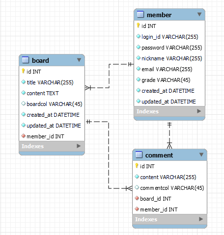

# 📝 커뮤니티 만들기

사용자분들과 생각, 정보를 주고 받을 수 있는 커뮤니티 서비스입니다.

## 🧾 프로젝트 기능 및 설계

- 유저 🧑🏻‍💻
    - 회원가입 기능
        - 사용자는 회원가입을 할 수 있다. 일반적으로 모든 사용자는 회원가입시 USER 권한 (일반 권한)을 가진다.
        - 회원가입시 아이디, 패스워드, 닉네임, 이메일을 입력받으며, 아이디, 닉네임은 Unique(중복x) 해야한다.
    - 로그인 기능
        - 사용자는 로그인 할 수 있다. 로그인시 회원가입한 아이디와 비밀번호가 일치해야한다.
    - 로그아웃 기능
        - 로그인한 사용자는 로그아웃을 할 수 있다.
    - 마이페이지 조회 기능
        - 로그인된 사용자는 마이페이지를 조회 할 수 있으며, 자신이 작성한 게시글, 댓글을 볼수있다. 그리고 비밀번호, 닉네임, 이메일 변경이 가능하다.
    - 회원정보 수정 기능
        - 회원가입된 사용자는 회원 정보를 수정할 수 있으며, 닉네임(중복되지 않는), 이메일등 수정 할 수 있다.
    - 비밀번호 수정 기능
        - 회원가입된 사용자는 비밀번호를 변경할 수 있다.
    - 회원 탈퇴 기능
        - 회원가입된 사용자는 회원 탈퇴를 할 수 있다.

---

- 게시글 📝
    - 작성 기능
        - 로그인한 사용자는 권한에 관계없이 게시글을 작성할 수 있다.
        - 사용자는 게시글의 제목, 내용을 입력할 수 있다.
    - 수정 기능
        - 로그인한 사용자는 자신이 작성한 게시글만 수정을 할 수 있다.
        - 사용자는 게시글의 제목, 내용을 수정할 수 있다.
    - 삭제 기능
        - 로그인한 사용자는 자신이 작성한 게시글만 삭제 할 수 있다.
    - 상세조회 기능
        - 사용자는 로그인 여부와 관계없이 게시글을 조회할 수 있다.
        - 게시글에는 제목, 내용, 댓글, 게시글 작성자, 게시글 작성일자를 조회할 수 있다.
    - 목록 조회 기능
        - 로그인하지 않은 사용자를 포함한 모든 사용자는 게시글을 조회할 수 있다.
        - 게시글은 최신순으로 기본 정렬된다.
        - 게시글 목록 조회시 응답에는 게시글 제목과 작성일, 댓글 수의 정보가 필요하다.
        - 게시글은 종류가 많을수 있으므로 Paging 처리를 한다.

---

- 댓글 ✏️
    - 작성 기능
        - 로그인한 사용자는 권한에 관계없이 게시글에 댓글을 작성할 수 있다.
        - 사용자는 댓글에 내용을 입력할 수 있다.
    - 수정 기능
        - 로그인한 사용자는 자신이 작성한 댓글만 수정할 수 있다.
        - 사용자는 댓글 내용만 수정이 가능하다.
    - 삭제 기능
        - 로그인한 사용자는 자신이 작성한 댓글만 삭제할 수 있다.

--- 

- 검색 🔎
    - 조회 기능
        - 로그인하지 않은 사용자를 포함한 모든 사용자는 게시글에 대해 검색할 수 있다.
        - 검색은 제목검색, 게시글 내용검색을 할 수 있으며, 검색 내용을 포함한 모든 데이터를 보여준다.(게시글 종류가 많은경우 Paging 처리)

## ERD 📚

## 도전 기능 🔥

## Trouble Shooting ⚙️

### Tech Stack 🛠️

 
   
   
   
  

